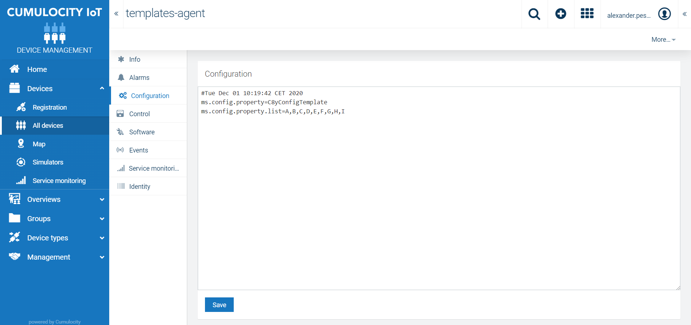

# templates-agent

## Summary
Usually it is good practice to have a representation of the microservice in your device management. This managed object is actually an
agent representation and can serve different use cases:

## Use case

- Metrics of your micoroservice, e.g. free / total / used memory; You can use measurements for that, to use Cumulocity and device management for visualization. Be aware for more sophisticated monitoring you should use standard like prometheus etc.
- Configure your microservice via UI: Be aware that your application properties are not easy to access in Kubernetes, with configuration operation you can setup a good way to configure your microservice at runtime! If you have tenant specific configuration you should use tenant options instead (see Microservice settings at https://cumulocity.com/guides/microservice-sdk/java/)
- Events/Alarms of your microservice; Use Events and Alarms to increase the transparency of you processes in your microservice. You could even generate alarms if an exception occures etc.
- Set specific parameter to your microservice (agent) representation, like software versions etc. 

More options are available, but be aware that "restart", "software update" etc. should not be done! The micoroservice is managed by cumulocity microservice hosting (Kubernetes).

Anyway, checkout out:
Cumulocity Device management library: https://cumulocity.com/guides/reference/device-management/

## How to run locally:

1. Build project

mvn clean install

2. Create application at cumulocity

POST 'https://{base-url}/application/applications'

Request body:

```javascript
{
  "key": "templates-agent",
  "name": "templates-agent",
  "contextPath": "templates-agent",
  "type": "MICROSERVICE",
  "manifest":{},	
	"requiredRoles": [
		"ROLE_INVENTORY_READ",
		"ROLE_INVENTORY_CREATE",
		"ROLE_INVENTORY_ADMIN",
		"ROLE_IDENTITY_READ",
		"ROLE_IDENTITY_ADMIN",
		"ROLE_AUDIT_READ",
		"ROLE_AUDIT_ADMIN",
		"ROLE_TENANT_MANAGEMENT_READ",
        	"ROLE_TENANT_MANAGEMENT_ADMIN",
        	"ROLE_OPTION_MANAGEMENT_READ",
        	"ROLE_OPTION_MANAGEMENT_ADMIN",
		"ROLE_DEVICE_CONTROL_READ",
		"ROLE_DEVICE_CONTROL_ADMIN"
	],
	"roles": [
	]
}
```

3. Subscribe application to your tenant via UI

4. Acquire microservice bootstrap credentials

GET 'https://{base-url}/application/applications/{applicationId}/bootstrapUser

Response body:

```javascript
{
    "password": "************************",
    "name": "servicebootstrap_templates-agent",
    "tenant": "<your tenant>"
}
```

5. Add bootstrap credentials 

to your src/main/resources/application-dev.properties

6. Start microservice with spring profile "dev"

java -Dspring.profiles.active=dev -jar cumulocity-microservice-templates-agent-0.0.1-SNAPSHOT.jar

## Features

At subscription, the microservice creates an agent representation. It reads some properties from application properties
and stores initial the key values into c8y_Configuration fragment as well. Via "c8y_Configuration" operation which is created
by pushing the "save" button, the configuration can also be changed. 



The microservice also exposes REST endpoints which returns property values:

GET /api/config/{key}

Example:
```
GET http://localhost:8080/api/config/ms.config.property.list

RESPONSE: A,B,C,D,E,F
```


## Disclaimer

These tools are provided as-is and without warranty or support. They do not constitute part of the Software AG product suite. Users are free to use, fork and modify them, subject to the license agreement. While Software AG welcomes contributions, we cannot guarantee to include every contribution in the master project.

## Contact

For more information you can Ask a Question in the [TECHcommunity Forums](http://tech.forums.softwareag.com/techjforum/forums/list.page?product=cumulocity).

You can find additional information in the [Software AG TECHcommunity](http://techcommunity.softwareag.com/home/-/product/name/cumulocity).

_________________
Contact us at [TECHcommunity](mailto:technologycommunity@softwareag.com?subject=Github/SoftwareAG) if you have any questions.
